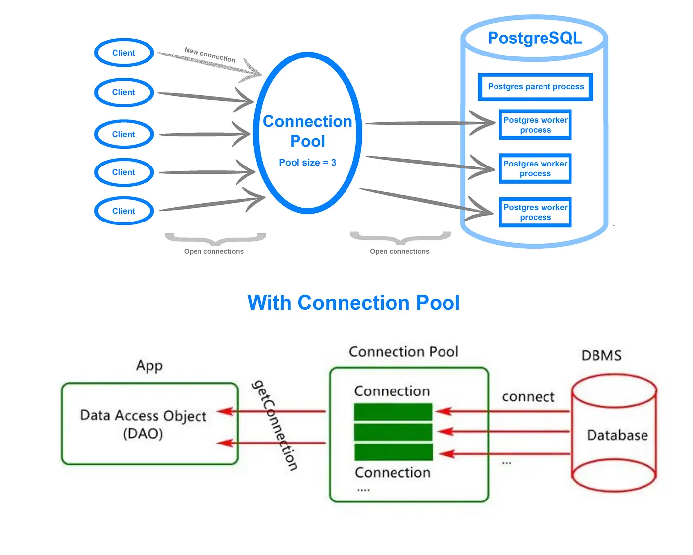

## Step 1 - The stack
We'll be building medium(blogging website) in the following stack
1. React in the frontend
2. Cloudflare workers in the backend(using Web application framework Hono)
3. zod as the validation library, type inference for the frantend types
4. Typescript as the language
5. Prisma as the ORM, with connection pooling
6. Postgres as the database
7. jwt for authentication (Cookies approach explained in the end as well)

## Flow
mkdir MediumPro
cd MediumPro
npm create hono@latest
<!-- wrangler dev ./backend/src/index.ts -->
<!-- cd backend 
npm run dev -->
1. POST /api/v1/signup
2. POST /api/v1/signin
3. POST /api/v1/blog
4. PUT /api/v1/blog
5. GET /api/v1/blog
- connect prisma : to easily interact with dbs.
And create connection pool using Prisma Accelarate to improve performance while interacting with db.

- get aiven pg DB url , use in accelarate and get accelarate pool url.
npm install prisma 
npx prisma init
- put connection pool url in wranglar.toml and aiven url in .env
- .env DBurl is used by prisma CLI (wranglar ) for migrate , generate etc
.toml is picked by backend like .ts files.

npx prisma migrate dev --name init_schema
npx prisma generate --no-engine
no-engine bcx we are deploying it on serverless arch
npm install @prisma/extension-accelerate

- add JWT 
  const token = await sign( res.id , c.env.JWT_SECRET);
c.env.JWT_SECRET IN wranglar.toml