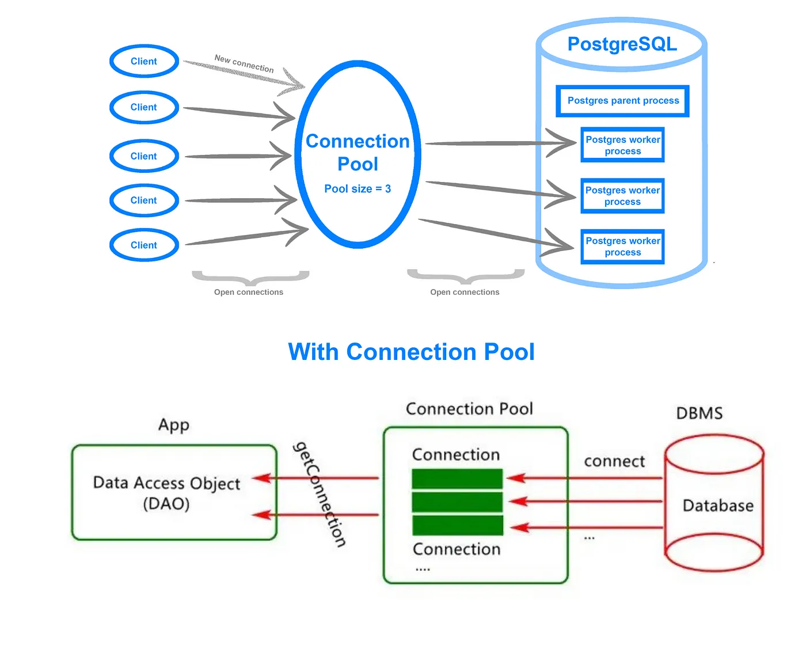

# MediumPro
A Blogging web application using React, Cloudflare Workers, and PostgreSQL for scalable and efficient backend and frontend operations.

## Features Overview : 
###  Frontend

1. React: For building the user interface with a focus on reusability and maintainability.

2. Zod: A schema declaration and validation library used for type-safe data handling and validation. It helps infer types seamlessly for robust and type-checked development in the frontend.

3. Debouncing: Implemented to enhance user experience by limiting the frequency of operations, like API calls or user-triggered events, during rapid interactions.

### Backend

1. Cloudflare Workers: Utilized as the backend infrastructure with the Hono web application framework, providing serverless, high-performance application hosting at the edge.

2. Hono: A lightweight and feature-rich framework ideal for building web applications on Cloudflare Workers.

### Database & ORM

1. PostgreSQL: Reliable and powerful relational database for storing application data.

2. Prisma: ORM for database management, incorporating type safety, connection pooling for scalability, and seamless integration with PostgreSQL.

### Authentication

1. JWT (JSON Web Tokens): Used to securely authenticate users, with tokens being stored in cookies for a safer approach.

###  Language
1.  TypeScript: The application is written entirely in TypeScript for type safety and to reduce runtime errors.

---

## Flow
mkdir MediumPro
cd MediumPro
npm create hono@latest
<!-- wrangler dev ./backend/src/index.ts -->
<!-- cd backend 
npm run dev -->
1. POST /api/v1/signup
2. POST /api/v1/signin
3. POST /api/v1/blog
4. PUT /api/v1/blog
5. GET /api/v1/blog
- connect prisma : to easily interact with dbs.
And create connection pool using Prisma Accelarate to improve performance while interacting with db.

- get aiven pg DB url , use in accelarate and get accelarate pool url.
npm install prisma 
npx prisma init
- put connection pool url in wranglar.toml and aiven url in .env
- .env DBurl is used by prisma CLI (wranglar ) for migrate , generate etc
.toml is picked by backend like .ts files.

npx prisma migrate dev --name init_schema
npx prisma generate --no-engine
no-engine bcx we are deploying it on serverless arch
npm install @prisma/extension-accelerate

- add JWT 
  const token = await sign( res.id , c.env.JWT_SECRET);
c.env.JWT_SECRET IN wranglar.toml
6. common zod 
npm i @akash.09/mediumprocommon

## after deploy 
requests can be sent from cloudfare url also

## Avatar initials iff jwt username also ...

